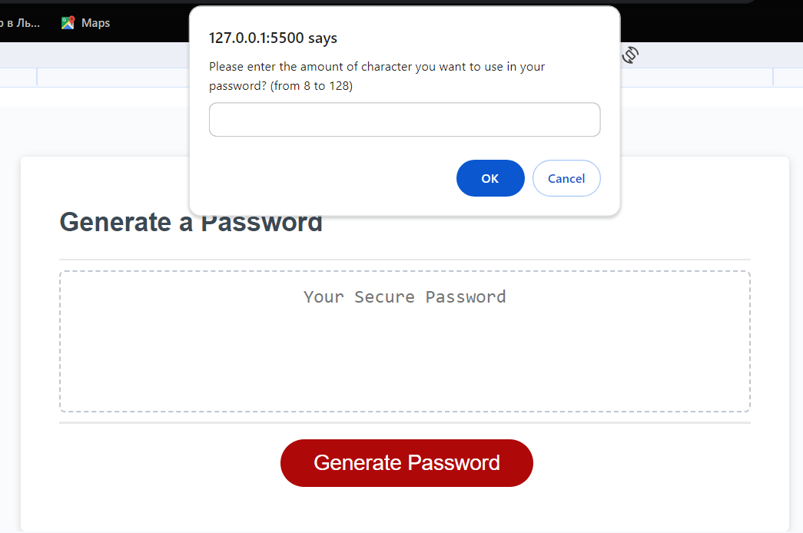
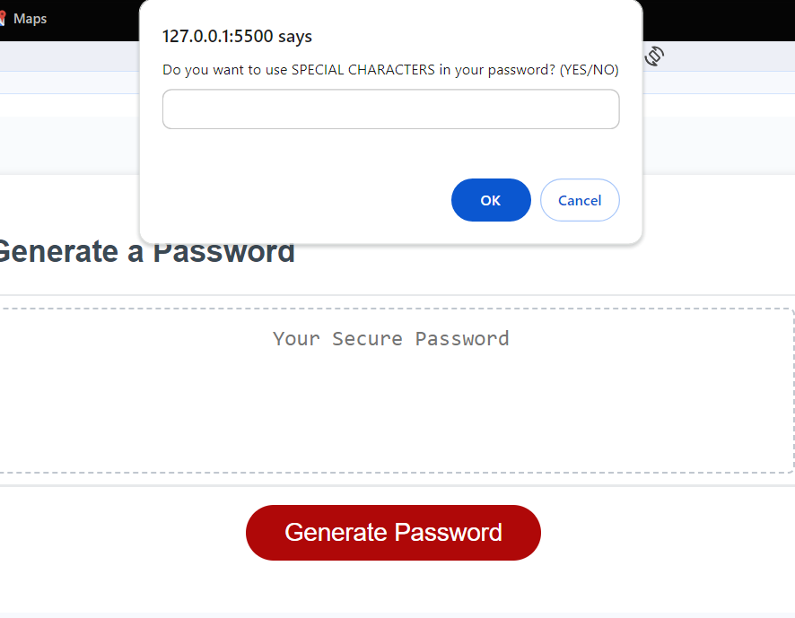

# Password-Generator

## Description

The Password Generator is a simple and secure tool that allows users to generate strong and unique passwords. It is designed to help individuals enhance their online security by creating complex passwords that are difficult for attackers to guess.

#### Features
* Random Passwords: Generate random and unpredictable passwords.
* Customization: Choose the length and character types for your passwords.
* Secure: The generated passwords follow best practices for security.

## Instalation

1. Visit my github profile https://github.com/OlehProtsak/Password-Generator and clone a code to your local computer.
2. Open index.html in your browser.
3. Customize Your Password.

#### Alternatively, utilize my application deployed on GitHub Pages https://olehprotsak.github.io/Password-Generator/

## Usage

1. Click 'Generate Password' button.
2. Follow the prompts to specify the password length and character types.
3. Copy and use the generated password for your accounts.

####  To ensure the proper functioning of the application, please input a valid number within the range of 8 to 128. Otherwise, you will receive an alert instructing you to enter a valid number.

#### To obtain a specific character type, enter "YES" in uppercase when prompted. Any other input, including words, numbers, empty fields, or canceled prompts, will be treated as if you do not wish to include that particular character type in your password.

## Credits

N/A

## Licenese

Please refer to the LICENSE in the repo.

---

© 2023 edX Boot Camps LLC. Confidential and Proprietary. All Rights Reserved.